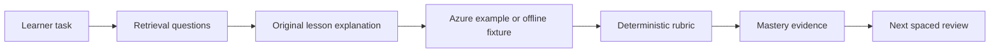

---
{
  "schema_version": 1,
  "lesson_id": "TEMPLATE",
  "title": "AI-103 lesson title",
  "competency_ids": ["GA-01"],
  "official_source_links": [
    "https://learn.microsoft.com/en-us/credentials/certifications/resources/study-guides/ai-103"
  ],
  "source_verified_at": "2026-07-25",
  "prerequisites": ["Read the AI-103 domain overview", "Know the target Azure service family"],
  "estimated_minutes": 45,
  "lab_links": ["scripts/labs/<planned-lab>.py"],
  "assessment_links": ["content/assessments/ai103/<domain>/<competency>.json"],
  "paraphrase_statement": "This lesson is an original paraphrase based on the source registry; it does not copy Microsoft prose."
}
---

# AI-103 Lesson Template

## Source Links

- Microsoft AI-103 study guide: https://learn.microsoft.com/en-us/credentials/certifications/resources/study-guides/ai-103

## Prerequisites and Duration

- Prerequisites: AI-103 domain overview, relevant Azure service family, local ALO workflow.
- Estimated duration: 45 minutes.

## Pre-Lesson Retrieval Questions

1. Closed book: What user goal or workload signal would make you choose this service or pattern?
2. Closed book: Which input, output, and grounding artifacts must be captured as evidence?
3. Closed book: What is one safety, cost, or governance check you must perform before a live Azure run?
4. Closed book: What failure mode would trigger remediation instead of promotion?

## Substantive Explanation

This section is the main teaching body. Replace this template text with an 800 to 1,500 word original explanation that connects the competency to a realistic Azure AI engineering decision. The lesson must explain what the learner is building, why the capability matters, how the Azure components fit together, what evidence proves the task worked, and how the idea transfers to a different scenario. Do not paste source text from Microsoft Learn. Use the official material as a boundary for scope, then teach the concept in the repository voice with concrete implementation details.

Start by naming the learner task in plain terms. A strong AI-103 lesson does not say only that a learner should understand a product feature. It describes the engineering decision the learner must make. For example, a generative AI lesson might ask the learner to decide whether a user request requires a simple prompt call, retrieval augmentation, a tool-using agent, or a multimodal flow. The learner should see the tradeoff between the options: direct generation is simpler, retrieval is better when answers must cite current private material, tools are useful when the system must take action, and multimodal inputs matter when the evidence is not just text. The explanation should make the decision boundary explicit because the exam and the job both test judgment, not memorized product names.

Next, connect the concept to the local-first orchestrator. The repository tracks mastery, confidence, tasks, and evidence in JSON and NDJSON files. A lesson should explain which learner evidence will be produced before, during, and after the activity. Retrieval questions capture first-attempt recall. Guided practice captures hinted evidence. Independent transfer captures whether the learner can apply the same idea without scaffolding. A deterministic rubric captures the score. Tutor feedback may coach the learner, but it must not decide correctness. This separation protects the study system from subjective grading and makes progress auditable.

Then explain the Azure-side shape without assuming live resources are always available. The lesson should identify the Azure services or SDK clients involved, the minimal inputs required, expected outputs, and the offline fixture that can simulate the same behavior. For a search lesson, that might mean documents, chunks, embeddings, an index schema, a query, and a set of expected retrieved passages. For a vision lesson, that might mean an image fixture, detected objects, text extraction, captions, and confidence values. For a governance lesson, that might mean policy settings, content filter expectations, telemetry fields, and cost limits. A learner should be able to run the lesson offline first and understand exactly what would change in a live Azure sandbox.

Use elaboration throughout. Ask why the pattern is appropriate, how it differs from a nearby option, and what consequence follows if the wrong option is chosen. Compare managed Azure features with custom code only when the comparison helps the learner make a decision. Include practical constraints such as cost, latency, data sensitivity, and teardown. AI-103 is not only about calling an endpoint; it is about designing a solution that fits the workload and can be operated responsibly.

Include dual coding with intent. The diagram must show real relationships among user input, orchestration code, Azure service calls, evidence artifacts, and learner feedback. Decorative diagrams do not count. The alt text must carry the same instructional meaning for a learner who cannot see the diagram. The reconstruction prompt should ask the learner to redraw or describe the architecture from memory, which reinforces retrieval practice and self-explanation.

End the explanation by preparing the learner for transfer. The worked example should be close to the lesson content and include enough steps to model expert reasoning. The guided exercise should fade hints: start with vocabulary or structure, then reduce help, then ask the learner to complete a step. The independent transfer exercise should change surface details so the learner cannot pattern-match blindly. For example, after a worked example about grounding a support chatbot, transfer might ask the learner to ground an internal compliance assistant with stricter citation and retention needs. The same principle applies, but the constraints force real understanding.

Finally, make the lesson operational. Name the file paths the learner will touch, the command they should run, the expected local artifact, and the event that will be written after completion. If the lesson has no executable lab yet, state the planned lab link and the offline evidence that can be checked today. The learner should never finish a lesson wondering whether progress was recorded. A complete lesson ends with a clear handoff: which competency was practiced, which attempt type was captured, what score threshold counts as passing, what remediation is triggered below threshold, and when the next review should happen. This keeps the content aligned with the Adaptive Learning Orchestrator instead of becoming a disconnected study note.

When the learner misses the passing threshold, the lesson should treat the result as useful diagnostic evidence, not as a vague failure. Point to the exact misconception, prerequisite, or missing checklist item that explains the score. Then prescribe a smaller remediation step: repeat one retrieval question, revisit one diagram edge, rerun one deterministic check, or complete the guided exercise before attempting the independent transfer again. When the learner passes independently, the lesson should fade support and schedule a spaced review instead of repeating the same task immediately. This is how the lesson keeps the learner inside the zone of proximal development: help is available when evidence shows it is needed, but the system withdraws that help when independent performance is strong enough to justify harder work.

## Mermaid Diagram



Alt text: A learner starts with closed-book retrieval, studies an original explanation, practices with an Azure-oriented example or offline fixture, receives deterministic scoring, records mastery evidence, and gets a future review task.

Diagram reconstruction prompt: From memory, redraw the path from learner task to next spaced review and label where evidence is captured.

## Concrete Azure Example

Scenario: A team needs an AI assistant that answers questions from internal deployment notes. The correct solution should ground responses in indexed content, return citations, and avoid unsupported claims. The lesson should name the Azure services, the local fixture that represents the indexed content, and the deterministic checks that prove the assistant retrieved the right evidence.

## Worked Example

1. Identify the user question and the required evidence.
2. Choose the Azure capability or local fixture that supplies that evidence.
3. Run the smallest deterministic check first.
4. Compare the output to the rubric.
5. Record first-attempt or corrected evidence separately.

## Guided Exercise with Fading Hints

- Hint 1, strong: Start by listing the input, expected output, and evidence artifact.
- Hint 2, faded: Choose between direct generation, retrieval, tool use, or multimodal analysis.
- Hint 3, minimal: Run the deterministic check and explain one mismatch.

## Independent Transfer Exercise

Transfer scenario: Apply the same competency to a different workload with a different data type, stricter safety requirement, or different latency budget. Complete the task without hints and record independent evidence.

## Elaboration Prompts

- Why is this Azure pattern appropriate for the scenario?
- How does it differ from the nearest alternative?
- What consequence follows if the learner chooses the wrong service or evidence artifact?
- Compare the offline fixture with the live Azure version.

## Feynman Self-Explanation

Explain the concept to a new teammate in plain language. Avoid product-name dumping. Include the user goal, the Azure capability, the evidence artifact, and the safety or cost constraint.

Concept checklist:

- Names the learner-visible goal.
- Names the Azure capability or local fixture.
- Explains why the choice fits.
- Identifies deterministic evidence.
- Mentions one safety, cost, or governance constraint.

## Common Misconceptions

- Treating tutor feedback as a score.
- Choosing a service name before identifying the workload evidence.
- Skipping offline fixtures and testing only with live Azure resources.
- Using a decorative diagram that does not explain system behavior.

## Lab Links

- `scripts/labs/<planned-lab>.py`

## Assessment Links

- `content/assessments/ai103/<domain>/<competency>.json`

## Answer Rubric Data

```json
{
  "schema_version": 1,
  "answers_are_separate_from_lesson": true,
  "retrieval_question_keys": ["rq1", "rq2", "rq3", "rq4"],
  "concept_checklist": [
    "learner-visible goal",
    "Azure capability or local fixture",
    "fit explanation",
    "deterministic evidence",
    "safety cost or governance constraint"
  ],
  "rubric_path": "content/assessments/ai103/<domain>/<competency>.json"
}
```
