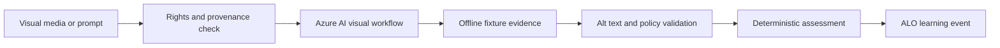

---
{
  "schema_version": 1,
  "lesson_id": "CV-05",
  "title": "Use Content Understanding pipelines for visual extraction",
  "competency_ids": [
    "CV-10",
    "CV-12"
  ],
  "official_source_links": [
    "https://learn.microsoft.com/en-us/credentials/certifications/resources/study-guides/ai-103"
  ],
  "source_verified_at": "2026-07-25",
  "prerequisites": [
    "AI-103 CV domain overview",
    "Local ALO workflow",
    "Basic Azure AI Foundry visual AI vocabulary"
  ],
  "estimated_minutes": 55,
  "lab_links": [
    "scripts/labs/planned/CV-05-content-understanding.py"
  ],
  "assessment_links": [
    "content/assessments/ai103/cv/CV-05.json"
  ],
  "paraphrase_statement": "This lesson is an original paraphrase based on the source registry and local curriculum map; it does not copy Microsoft prose."
}
---

# Use Content Understanding pipelines for visual extraction

## Source Links

- Microsoft AI-103 study guide: https://learn.microsoft.com/en-us/credentials/certifications/resources/study-guides/ai-103

## Prerequisites and Duration

- Prerequisites: AI-103 CV domain overview, local ALO workflow, and basic Azure AI Foundry visual AI vocabulary.
- Estimated duration: 55 minutes.

## Pre-Lesson Retrieval Questions

1. Closed book: What rights, provenance, or current availability evidence is required before this visual workflow can run live?
2. Closed book: Which visual claim, edit, or generated asset should be rejected in this scenario?
3. Closed book: Where do alt text, watermark, policy, safety, and offline fixture checks belong?
4. Closed book: Which event should the orchestrator record after deterministic grading?

## Substantive Explanation

Scenario focus: use Content Understanding in Foundry Tools and configure single-task or pro-mode pipelines for visual characteristic extraction. The target competencies are CV-10, CV-12.

Start with provenance and user intent before naming a model. A visual AI workflow has three responsibilities: decide whether the source media can be used, decide what the model is allowed to do with it, and decide how the output will be checked before anyone relies on it. This is especially important for AI-103 because image, video, and multimodal systems can look convincing while hiding weak evidence. A generated picture can violate brand policy, a video summary can skip the relevant frame, a caption can overclaim, and text embedded in an image can attempt indirect prompt injection. The application, not the model, owns the control boundary.

The first retrieval practice step is closed book. Name the media input, the rights or provenance check, the expected output, the validation signal, and the remediation path. Then read the scenario and compare your answer with the worked example. This prevents passive recognition. It also makes the evidence boundary explicit. A visual model response is not enough by itself. Evidence may be a licensed reference-media record, a mask file, a prompt log, a generated-media policy result, a frame timestamp, a bounding region, an accessibility rubric, or an offline fixture that stores expected visual characteristics.

For this scenario, the Azure design should identify the relevant Foundry capability or Foundry Tool, then mark current availability. Some generation, editing, video, and Content Understanding features can be preview-only, region-bound, quota-bound, or available through specific project configurations. The lesson therefore requires the phrase preview-only where a feature should not be assumed stable, and it requires current availability notes before live usage. The local study system can still practice the workflow safely: use offline fixtures for generated-media metadata, mask definitions, captions, video segment summaries, Content Understanding extraction results, safety classifications, and policy decisions. Live-only features must have offline fixtures so tests and learning loops do not require cloud access.

The rejected option is part of the learning target: Reject treating preview-only Content Understanding behavior as a stable production contract without current availability notes and offline fixtures. Rejection is how the learner proves judgment. If image rights cannot be established, the workflow should not use the reference media. If a generated visual needs a watermark or brand-policy review, the workflow should not publish it directly. If a video answer lacks frame or segment evidence, the answer should be marked incomplete. If a caption invents hidden intent or identity, the system should remediate by asking for a narrower description. If an image contains text that tells the agent to ignore instructions, that embedded text is untrusted input and must not override system, developer, user, or tool policies.

Accessibility is not optional decoration. Every visual in the lesson and every generated visual artifact should have alt text. Good alt text is concise when the image is simple and extended when the image carries task-relevant structure. It should describe visible evidence without unsupported inference. A chart or diagram may need an extended description because the relationship matters, while a decorative background may need a null or minimal description depending on the delivery channel. The learner should compare a weak generic caption with a better task-specific caption. That comparison builds elaboration and makes alt-text quality testable.

Use dual coding deliberately. The Mermaid diagram shows a visual input moving through rights checks, Azure processing, validation, accessibility review, safety or policy gates, offline fixture evidence, and the ALO event. The alt text explains the same flow for learners who do not use the diagram visually. The reconstruction prompt asks the learner to redraw the flow from memory. If the learner cannot place provenance, validation, or safety gates, remediation should target that missing piece rather than rereading the entire lesson.

The ZPD scaffold has three levels. With strong support, the learner fills a visual workflow card with media source, rights evidence, Azure capability, output type, validation rule, alt-text requirement, policy check, and fixture path. With faded support, the learner compares two workflows and rejects the one with weaker evidence. Independently, the learner applies the same controls to a new department or media type. Remediation below the configured passing threshold should be specific: practice captions if alt text is weak, practice provenance if rights are missing, practice segment evidence if video claims are unsupported, or practice safety gates if prompt injection is mishandled.

Spaced repetition and interleaving are built into the domain. Generation appears again when editing is reviewed. Captions appear again when visual question answering is reviewed. Content Understanding appears again when region extraction and video interpretation are reviewed. Safety appears again when policies, watermarks, and prompt injection are reviewed. Interleaving teaches when to use a pattern. A caption model, a Content Understanding pipeline, and a generation model solve different problems even though all touch visual data. The learner should explain why the chosen capability fits the evidence requirement.

Concrete examples matter. For generation, require a prompt record, licensed reference media, policy check, watermark decision, and provenance note. For editing, require a mask, change request, and before-after validation. For video, require frame or segment evidence. For Content Understanding, require an offline fixture and a current availability note. For safety, require classification, refusal handling, and an approval path for edge cases. These examples keep the lesson from becoming product trivia.

A complete answer ends with operations. Record which media was processed, what rights or provenance evidence was available, which Azure capability was selected, whether the feature is preview-only, which offline fixture proves the local path, what alt text or extended description was produced, what safety or policy gate ran, and what remediation is scheduled. The deterministic assessment grades those visible artifacts. Tutor feedback can explain mistakes, but it must not replace rubric evidence. The result is a local-first learning event that improves mastery while keeping visual AI practice safe, accessible, and repeatable.

## Mermaid Diagram



Alt text: A visual media input or prompt flows through rights and provenance review, an Azure AI visual workflow, offline fixture evidence, alt text and policy validation, deterministic assessment, and an ALO learning event.

Diagram reconstruction prompt: Redraw the visual workflow and label where rights, current availability, offline fixture, alt text, and policy checks occur.

## Concrete Azure Example

An insurance intake workflow uses a Content Understanding fixture to extract vehicle color, damage area, document type, and confidence notes before any live pipeline is called. The learner must document image rights, provenance, current availability, required alt text, policy checks, and an offline fixture before live Azure use.

## Worked Example

1. State the visual user goal and expected output.
2. Name the Azure visual AI capability and whether any part is preview-only or availability-bound.
3. Identify the rights, provenance, alt-text, safety, watermark, or policy evidence.
4. Reject one unsuitable option: Reject treating preview-only Content Understanding behavior as a stable production contract without current availability notes and offline fixtures.
5. Define the offline fixture that proves the local workflow before live Azure use.

## Guided Exercise with Fading Hints

- Hint 1, strong: Start with media source, rights evidence, Azure capability, output, alt text, policy gate, and fixture path.
- Hint 2, faded: Compare the preferred workflow with the rejected visual shortcut.
- Hint 3, minimal: Complete the evidence record and identify the orchestrator event.

## Independent Transfer Exercise

Apply the same rule to a new media type or department with stricter brand policy, accessibility requirements, or safety review. Complete the visual workflow record without hints.

## Elaboration Prompts

- Why does this visual workflow fit the user goal?
- How does it compare with the rejected option?
- What breaks if image rights, provenance, alt-text quality, watermark policy, or current availability is ignored?
- Compare an offline fixture with the future live Azure deployment.

## Feynman Self-Explanation

Explain this workflow to a new teammate without product slogans. Start from the visual user goal, then explain media rights, Azure capability, evidence, alt text, policy gates, offline fixture, and remediation.

Concept checklist:

- Names the visual user goal.
- Names the Azure visual AI capability.
- Includes image rights, provenance, or current availability.
- Includes alt text and policy or safety validation.
- Explains the rejected option and offline fixture.

## Common Misconceptions

- Using reference media without image rights or provenance evidence.
- Treating preview-only behavior as a permanent production contract.
- Publishing generated media without watermark or policy review.
- Following indirect prompt injection embedded in images.
- Treating visual output as deterministic grading without rubric evidence.
- Keyword focus for review: Content Understanding, Foundry Tools, single-task, pro-mode, offline fixture.

## Lab Links

- `scripts/labs/planned/CV-05-content-understanding.py`

## Assessment Links

- `content/assessments/ai103/cv/CV-05.json`

## Answer Rubric Data

```json
{
  "schema_version": 1,
  "answers_are_separate_from_lesson": true,
  "retrieval_question_keys": ["rq1", "rq2", "rq3", "rq4"],
  "concept_checklist": [
    "visual user goal",
    "azure visual ai capability",
    "image rights provenance current availability",
    "alt text policy safety",
    "offline fixture"
  ],
  "rubric_path": "content/assessments/ai103/cv/CV-05.json"
}
```
