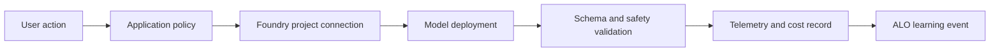

---
{
  "schema_version": 1,
  "lesson_id": "GA-01",
  "title": "Deploy and consume Foundry models",
  "competency_ids": [
    "GA-01"
  ],
  "official_source_links": [
    "https://learn.microsoft.com/en-us/credentials/certifications/resources/study-guides/ai-103"
  ],
  "source_verified_at": "2026-07-25",
  "prerequisites": [
    "AI-103 GA domain overview",
    "Local ALO workflow",
    "Basic Azure AI Foundry project vocabulary"
  ],
  "estimated_minutes": 55,
  "lab_links": [
    "scripts/labs/planned/GA-01-model-consumption.py"
  ],
  "assessment_links": [
    "content/assessments/ai103/ga/GA-01.json"
  ],
  "paraphrase_statement": "This lesson is an original paraphrase based on the source registry and local curriculum map; it does not copy Microsoft prose."
}
---

# Deploy and consume Foundry models

## Source Links

- Microsoft AI-103 study guide: https://learn.microsoft.com/en-us/credentials/certifications/resources/study-guides/ai-103

## Prerequisites and Duration

- Prerequisites: AI-103 GA overview, local ALO workflow, and basic Azure AI Foundry project vocabulary.
- Estimated duration: 55 minutes.

## Pre-Lesson Retrieval Questions

1. Closed book: What information must an application know before it can call a deployed model?
2. Closed book: Which failure should stop a model call from being treated as reliable application output?
3. Closed book: How would you estimate token cost before expanding usage?
4. Closed book: Which event should the orchestrator record after deterministic grading?

## Substantive Explanation

Scenario focus: Deploy and consume a language, code, small, or multimodal model through Azure AI Foundry without turning the model response into an unchecked source of truth. This lesson practices GA-01.

Start with the application boundary. A deployed model is not the application; it is one dependency inside an application workflow. The app still owns identity, configuration, request shaping, output validation, retries, logging, cost control, safety handling, and user experience. A correct AI-103 answer names the model endpoint or deployment as one part of the design, then explains how the app proves that a call was allowed, shaped correctly, measured, and handled safely. Do not hardcode one model deployment as the universal answer. Model families, deployment names, rate limits, regional availability, and multimodal support can change. The stable skill is knowing what must be configured and verified.

Before any live call, identify the project connection, credential path, endpoint, deployment name, API version or SDK surface, request payload, and expected response shape. Use managed identity or a scoped secret store where possible; do not embed keys in lesson notebooks, logs, or sample answers. For local practice, use an offline fixture that represents a model response and a metadata object that records token counts, latency, model name, safety status, and request identifier. The learner can validate the client code path against that fixture before spending Azure quota. Live execution comes later, guarded by sandbox setup, budget limits, and teardown instructions.

The Responses API pattern is useful because it treats generation as a structured operation rather than a loose chat transcript. The application can send instructions, input content, tool declarations, and response format requirements, then inspect usage and output items. The learner should understand the difference between asking a model to produce JSON and enforcing that the application validates JSON after receipt. The model may produce malformed output, omit fields, answer outside scope, or fabricate citations. The application must reject invalid responses, request remediation, or fall back to a safer path. Model output is evidence to inspect, not authoritative grading.

Token cost should be planned early. A request has input tokens, output tokens, and sometimes extra tokens from retrieved context, tool results, system instructions, or multimodal content. Larger context windows make it easier to include more material, but they also raise cost and latency risk. A practical design estimates worst-case input size, output size, expected calls per user action, retries, and concurrent load. The learner should record a budget gate such as maximum prompt length, maximum generated tokens, caching policy, and alert threshold. If a scenario ignores token cost entirely, it is incomplete.

Failure handling matters as much as the happy path. A deployment can be unavailable, throttled, misconfigured, under quota pressure, or unsuitable for the content type. The client should handle retryable errors differently from validation errors. A retry may help after transient throttling, but it does not fix a prompt that requests prohibited content or a response that violates a schema. The design should record trace identifiers so the failed call can be investigated without exposing user secrets or sensitive prompt content. This prepares the learner for operational questions where the issue is not model intelligence but the surrounding application contract.

Use retrieval practice before reading and spaced review after assessment. First, answer from memory what a model client needs. Then compare the answer with the worked example. Later, revisit the same idea in a RAG lesson, an agent lesson, and an operations lesson. Interleaving prevents the learner from treating generation as isolated prompt writing. The same call pattern interacts with identity, grounding, tools, evaluation, and monitoring. Elaboration strengthens the concept by asking why each control exists: identity prevents unauthorized calls, validation prevents malformed output from reaching users, and usage metadata keeps cost visible.

Dual coding should make the request path visible. Draw the user action, application policy, Foundry project connection, model deployment, response validation, telemetry, and orchestrator event. Then reconstruct the diagram without looking. This is not decoration; it makes the hidden dependencies explicit. A learner who can redraw the path is more likely to remember where approval, validation, and cost checks belong.

The ZPD scaffold is simple. With strong support, the learner fills in missing fields in a model call contract. With faded support, the learner compares two deployments and chooses one based on modality, latency, and cost. Independently, the learner writes a decision record for a new app and includes failure handling. Below the passing threshold, remediation should target the missing control, not repeat the whole lesson. Above the threshold, schedule a spaced transfer case that adds retrieval or tools.

For completion, the learner should state what changes between a classroom fixture and live Azure use. In the fixture, the response body, token counts, latency, and safety status are known data. In live use, the same fields are produced by a deployed service and can fail because of quota, network, policy, content, or configuration issues. The application design should keep those cases separate. A fixture proves the local parser, rubric, and remediation logic. A live call proves only that the deployed configuration works under the current subscription, region, identity, and quota posture. Mixing the two creates weak evidence because a successful demo can hide a missing validation rule.

The learner should also practice explaining parameter choices. Temperature, maximum output length, response format, tool availability, and context size are not decorative settings. Each changes reliability, latency, cost, or safety exposure. A short deterministic extraction task should use tighter settings and stricter schema validation than an exploratory brainstorming task. A multimodal request may require different input checks and a higher cost estimate than a text-only request. The right answer does not memorize one setting. It connects the setting to the workload evidence and records what signal would trigger adjustment later.

Finally, the lesson should connect model consumption to remediation. If the model response is malformed, remediation may be schema repair or prompt tightening. If the answer is unsupported, remediation may be retrieval grounding. If latency is too high, remediation may be token reduction, caching, or a smaller model. If safety checks fail, remediation may be refusal handling or a stronger policy gate. If cost exceeds the budget, remediation may be summarizing context before the call or routing simple work to a cheaper deployment. These concrete examples make the model call operational rather than magical.

## Mermaid Diagram



Alt text: A user action flows through application policy, a Foundry project connection, a model deployment, response validation, telemetry, and finally an ALO learning event.

Diagram reconstruction prompt: Redraw the model-call path from user action to learning event and label the validation and cost gates.

## Concrete Azure Example

A help desk app calls an Azure AI Foundry model to draft a response. The learner must name the deployment configuration, the credential boundary, the expected response shape, the token-cost estimate, and the validation behavior when the response fails the schema.

## Worked Example

1. Define the user action and expected response type.
2. Identify the Foundry project connection, deployment name, and credential boundary.
3. Estimate input tokens, output tokens, retry risk, and latency target.
4. Reject treating model output as authoritative grading.
5. Define the offline fixture that validates response shape before live Azure use.

## Guided Exercise with Fading Hints

- Hint 1, strong: Start with endpoint, deployment, credential, request payload, response shape, and token budget.
- Hint 2, faded: Compare a direct call with a call that also validates JSON and safety metadata.
- Hint 3, minimal: Complete the model-call contract and identify the orchestrator event.

## Independent Transfer Exercise

Apply the same model-call contract to a multimodal support case that accepts text and an image. Include what changes in payload validation and cost estimation.

## Elaboration Prompts

- Why is a deployed model only one dependency in the application?
- How does response validation compare with trusting generated text directly?
- What happens when retries are used for schema failures instead of transient failures?
- Compare a small model choice with a larger model choice under a strict latency budget.

## Feynman Self-Explanation

Explain model consumption to a new teammate without starting from model branding. Start with the user action, then describe connection, credentials, request, validation, telemetry, and cost.

Concept checklist:

- Names the model-call contract.
- Includes identity and configuration.
- Includes schema or safety validation.
- Estimates token cost or latency.
- Rejects authoritative grading by model output alone.

## Common Misconceptions

- Hardcoding one deployment as the answer for every workload.
- Treating generated JSON as valid without parsing and checking it.
- Retrying safety or schema failures as if they were transient outages.
- Ignoring token cost until after the app is popular.

## Lab Links

- `scripts/labs/planned/GA-01-model-consumption.py`

## Assessment Links

- `content/assessments/ai103/ga/GA-01.json`

## Answer Rubric Data

```json
{
  "schema_version": 1,
  "answers_are_separate_from_lesson": true,
  "retrieval_question_keys": ["rq1", "rq2", "rq3", "rq4"],
  "concept_checklist": [
    "model-call contract",
    "identity configuration",
    "response validation",
    "token cost",
    "non-authoritative model output"
  ],
  "rubric_path": "content/assessments/ai103/ga/GA-01.json"
}
```
