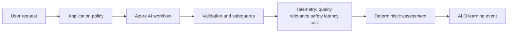

---
{
  "schema_version": 1,
  "lesson_id": "GA-06",
  "title": "Define agent roles, goals, and tool schemas",
  "competency_ids": [
    "GA-07"
  ],
  "official_source_links": [
    "https://learn.microsoft.com/en-us/credentials/certifications/resources/study-guides/ai-103"
  ],
  "source_verified_at": "2026-07-25",
  "prerequisites": [
    "AI-103 GA domain overview",
    "Local ALO workflow",
    "Basic Azure AI Foundry vocabulary"
  ],
  "estimated_minutes": 55,
  "lab_links": [
    "scripts/labs/planned/GA-06-agent-contract.py"
  ],
  "assessment_links": [
    "content/assessments/ai103/ga/GA-06.json"
  ],
  "paraphrase_statement": "This lesson is an original paraphrase based on the source registry and local curriculum map; it does not copy Microsoft prose."
}
---

# Define agent roles, goals, and tool schemas

## Source Links

- Microsoft AI-103 study guide: https://learn.microsoft.com/en-us/credentials/certifications/resources/study-guides/ai-103

## Prerequisites and Duration

- Prerequisites: AI-103 GA domain overview, local ALO workflow, and basic Azure AI Foundry vocabulary.
- Estimated duration: 55 minutes.

## Pre-Lesson Retrieval Questions

1. Closed book: What evidence proves this generative AI workflow is safe enough to use?
2. Closed book: Which shortcut should be rejected for this scenario?
3. Closed book: Where do quality, relevance, safety, latency, and cost get measured?
4. Closed book: Which event should the orchestrator record after deterministic grading?

## Substantive Explanation

Scenario focus: Define agent roles, goals, conversation tracking, and tool schemas so the agent has bounded responsibilities and auditable actions. The target competencies are GA-07.

Begin by naming the application contract, not the model brand. A generative feature has an input boundary, a policy boundary, a reasoning or generation step, an output boundary, and an operating boundary. The application owns those boundaries even when a model performs the language work. That distinction matters for AI-103 because many plausible answers sound useful but are not safe enough to operate. A model can draft, summarize, classify, reason over supplied context, or request a tool call, but the surrounding application must decide what data is allowed in, what actions are permitted, how output is validated, what evidence is logged, and when a human must approve the result. This lesson uses the local orchestrator to practice that decision loop without spending Azure quota on every attempt.

The first learning move is retrieval practice. Before reading implementation details, recall what the workflow needs: identity, configuration, input constraints, prompt or instruction design, context selection, validation, telemetry, and remediation. Then compare your answer with the worked example. This sequence prevents passive recognition. It also exposes the misconception that a generated answer becomes correct because it is fluent. Fluency is not evidence. Evidence comes from a checked citation, a parsed schema, a deterministic rubric, a trace, a safety result, an approval record, or a repeatable offline fixture. When the lesson asks you to grade your answer, the deterministic assessment file is the authority; tutor feedback can explain, but it must not assign mastery by opinion.

The Azure design should be explicit about Foundry project setup and service boundaries. A learner should be able to state which project connection, model deployment, search index, tool API, content store, or monitoring path is involved. The design should also state which parts are safe to practice offline. For example, a fixture can represent retrieved passages, tool responses, evaluation scores, token usage, and latency measurements. Offline fixtures make the lesson repeatable, and live Azure calls can be added later behind free-tier or sandbox prerequisites, budget limits, and teardown steps. If a design needs live resources, the answer should say what must be configured before use and what signal proves the resource can be destroyed afterward.

For this scenario, the rejected option is load-bearing: Reject a vague all-purpose agent role because broad instructions make authorization, testing, and failure analysis weak. Rejection is not negativity; it is engineering control. A learner who can explain why an attractive shortcut fails is closer to operating the system independently. Use concrete examples. A retrieval workflow may fail because the top passages are irrelevant. A tool workflow may fail because arguments are malformed or unauthorized. An agent workflow may fail because a handoff loses context. An evaluation workflow may fail because the metric is too vague. An operations workflow may fail because token cost grows silently. The answer should identify the specific failure and the remediation that would move the learner back into the zone of proximal development.

The ZPD scaffold uses three levels of support. With strong support, you complete a partially filled design record that names the input, Azure component, validation check, telemetry signal, and remediation action. With faded support, you compare two designs and choose one using the evidence criteria. With minimal support, you handle a transfer case where the surface details change. Passing is not just remembering a term. Passing means you can use the term to make a bounded design decision and defend it with observable evidence. When the score is below the configured threshold, remediation targets the missing primitive: retrieve the concept, redraw the architecture, compare the rejected option, or explain the idea in plain language.

Spaced repetition and interleaving keep the lesson from becoming isolated trivia. This topic will reappear in model calls, RAG, tools, evaluations, agents, operations, and optimization. Each return should be slightly different. One review might ask for cost controls. Another might ask for a failure trace. Another might ask where human approval belongs. This spacing makes the memory stronger, and interleaving teaches when to use a pattern rather than simply recognizing it after a heading announces the answer.

Dual coding makes invisible contracts visible. The diagram should show a user request entering application policy, moving through an Azure AI component, returning through validation, and producing telemetry plus an ALO event. The alt text carries the same meaning for accessibility. The reconstruction prompt asks you to redraw the diagram from memory because the goal is active recall. If you cannot redraw where validation, approval, or cost control happens, you probably cannot operate the workflow under pressure.

Elaboration turns implementation facts into durable reasoning. Explain why the chosen pattern fits this scenario, how it compare with the rejected option, and what breaks when the control is skipped. Include fabrication, tool failure, token cost, and approval-flow examples where relevant. For example, a fabricated answer is handled by grounding and evaluation, a tool failure is handled by schema validation and typed errors, token cost is handled by limits and telemetry, and approval flow is handled by a gate before side effects. These are not separate memorized facts; they are repeated applications of the same control idea.

A complete answer includes operations. Record quality, relevance, safety, latency, and cost when the workflow produces user-facing output. Record tool name, validated arguments, result status, and approval state when the workflow can act. Record retrieval query, selected chunks, citations, and fallback state when the workflow depends on knowledge. Record model name, parameters, token usage, and trace identifiers when comparing deployments. These records support debugging and prevent the system from relying on undocumented intuition.

Use the Feynman technique at the end. Explain the lesson to a new teammate in plain language: what the user wants, what the Azure workflow does, what could go wrong, what evidence proves it worked, and what the orchestrator records. If your explanation needs hidden internal reasoning to sound convincing, rewrite it around visible evidence instead. The exam target is practical design and implementation judgment. The local study target is repeatable mastery: answer from memory, practice with support, transfer without support, grade deterministically, remediate below threshold, and schedule spaced review after success.

## Mermaid Diagram



Alt text: A user request passes through policy, an Azure AI workflow, validation and safeguards, telemetry covering quality relevance safety latency and cost, deterministic assessment, and an ALO learning event.

Diagram reconstruction prompt: Redraw the workflow from user request to learning event and label validation, approval, and telemetry gates.

## Concrete Azure Example

An intake agent can classify requests and propose a tool call, but the application validates the schema and records the conversation state before any action executes. The learner must identify the Azure component, validation gate, telemetry record, and remediation path before any live resource is used.

## Worked Example

1. State the user goal and expected output.
2. Name the Azure AI workflow component and configuration boundary.
3. Identify the validation or safeguard that prevents unsafe output.
4. Reject one unsuitable option: Reject a vague all-purpose agent role because broad instructions make authorization, testing, and failure analysis weak.
5. Define the offline fixture or trace that proves the decision before live Azure use.

## Guided Exercise with Fading Hints

- Hint 1, strong: Start with user goal, Azure component, validation gate, telemetry, and remediation.
- Hint 2, faded: Compare the preferred workflow with the rejected shortcut.
- Hint 3, minimal: Complete the decision record and identify the orchestrator event.

## Independent Transfer Exercise

Apply the same rule to a different department with stricter privacy, lower token budget, or a required approval flow. Complete the design record without hints.

## Elaboration Prompts

- Why does this workflow fit the user goal?
- How does it compare with the rejected option?
- What breaks if fabrication, tool failure, token cost, or approval-flow risk is ignored?
- Compare an offline fixture with the future live Azure deployment.

## Feynman Self-Explanation

Explain this workflow to a new teammate without relying on product slogans. Start from the user goal, then explain the Azure component, validation gate, telemetry, and remediation path.

Concept checklist:

- Names the user goal.
- Names the Azure AI workflow component.
- Includes validation or safeguards.
- Measures quality, relevance, safety, latency, or cost.
- Explains the rejected option and remediation.

## Common Misconceptions

- Treating model output as authoritative grading.
- Skipping tool schema validation or human approval when actions have side effects.
- Measuring only answer fluency while ignoring relevance, safety, latency, and cost.
- Hiding failure analysis inside private reasoning instead of recording visible evidence.
- Keyword focus for review: agent role, goal, conversation tracking, tool schema validation, audit.

## Lab Links

- `scripts/labs/planned/GA-06-agent-contract.py`

## Assessment Links

- `content/assessments/ai103/ga/GA-06.json`

## Answer Rubric Data

```json
{
  "schema_version": 1,
  "answers_are_separate_from_lesson": true,
  "retrieval_question_keys": ["rq1", "rq2", "rq3", "rq4"],
  "concept_checklist": [
    "user goal",
    "azure ai workflow",
    "validation or safeguards",
    "quality relevance safety latency cost",
    "rejected option"
  ],
  "rubric_path": "content/assessments/ai103/ga/GA-06.json"
}
```
