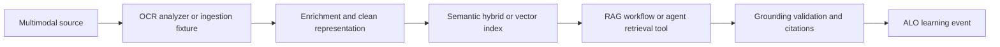

---
{
  "schema_version": 1,
  "lesson_id": "IE-03",
  "title": "Enrich content with built-in and custom skills",
  "competency_ids": [
    "IE-03"
  ],
  "official_source_links": [
    "https://learn.microsoft.com/en-us/credentials/certifications/resources/study-guides/ai-103"
  ],
  "source_verified_at": "2026-07-25",
  "prerequisites": [
    "AI-103 IE domain overview",
    "Local ALO workflow",
    "Basic Azure AI Search, RAG, OCR, and Content Understanding vocabulary"
  ],
  "estimated_minutes": 55,
  "lab_links": [
    "scripts/labs/planned/IE-03-enrichment.py"
  ],
  "assessment_links": [
    "content/assessments/ai103/ie/IE-03.json"
  ],
  "paraphrase_statement": "This lesson is an original paraphrase based on the source registry and local curriculum map; it does not copy Microsoft prose."
}
---

# Enrich content with built-in and custom skills

## Source Links

- Microsoft AI-103 study guide: https://learn.microsoft.com/en-us/credentials/certifications/resources/study-guides/ai-103

## Prerequisites and Duration

- Prerequisites: AI-103 IE domain overview, local ALO workflow, and basic Azure AI Search, RAG, OCR, and Content Understanding vocabulary.
- Estimated duration: 55 minutes.

## Pre-Lesson Retrieval Questions

1. Closed book: What source modality and extraction artifact does this workflow require?
2. Closed book: Which search mode, enrichment step, OCR path, or analyzer output should be rejected?
3. Closed book: What evidence proves the representation is grounded and usable by RAG or an agent tool?
4. Closed book: Which event should the orchestrator record after deterministic grading?

## Substantive Explanation

Scenario focus: enrich content with custom and built-in skills for text, images, and layout. The target competencies are IE-03.

Start with the retrieval contract. Information extraction is not only pulling text from files. It is the process of turning messy source material into grounded, searchable, reviewable representations that a user, RAG flow, or agent can use safely. The source may be a PDF, scanned image, photograph, audio transcript, video segment, table, form, diagram, or mixed bundle. The learner should identify input modality, extraction path, enrichment path, index representation, validation evidence, and downstream consumer before selecting a service. This preserves the local-first ALO principle: learn the contract with deterministic fixtures before spending Azure quota.

The first retrieval practice step is closed book. Name the source material, the extraction artifact, the search or analyzer path, the grounding requirement, the validation check, and the remediation action. Then compare your answer with the worked example. This prevents the common error of treating ingestion as a one-way upload. A retrieval system can fail at OCR, chunking, metadata, enrichment, embedding, ranking, citation mapping, field extraction, or agent-tool argument validation. The answer must say which failure is being controlled.

For this scenario, the rejected option is important: Reject enrichment that changes source meaning without recording skill inputs, outputs, and confidence evidence. Rejection proves the learner can protect downstream generation. If a scanned document is not OCR-checked, a RAG answer may miss the most important clause. If a vector index has weak chunks, semantic relevance may look high while citations are poor. If enrichment changes meaning, the index may preserve a polished falsehood. If an agent retrieval tool accepts arbitrary arguments, it can query the wrong store or leak context. If a Content Understanding analyzer omits source references, the output cannot safely ground an answer.

Search modes should be chosen by evidence. Keyword search can be strong for exact names, identifiers, and controlled vocabulary. Semantic search can help with meaning-based matching. Vector search can connect paraphrased queries and embeddings. Hybrid search can combine lexical and vector signals. The learner should compare modes using relevance, citation coverage, latency, cost, and failure examples. No single mode is universal. A complete design records why the selected mode fits the corpus and query pattern, and what metric would trigger retuning.

RAG ingestion requires more than retrieval. The workflow should define chunk size, overlap, metadata, citation boundaries, source refresh, and handling for low-confidence matches. OCR adds another risk layer because extraction quality depends on source layout, scan quality, tables, handwriting, and images. Multimodal ingestion adds even more: image captions, video segment labels, audio transcripts, and layout regions may each require separate validation. Offline fixtures are mandatory for lessons because they let the learner inspect expected OCR text, chunks, metadata, embeddings placeholders, search results, analyzer output, and citations without live cloud resources.

Enrichment should be auditable. Built-in and custom skills can add entities, key phrases, captions, layout features, normalized fields, or domain tags. These enrichments are useful only when their source, confidence, and transformation rule are visible. The lesson should teach the learner to compare original content with enriched content. If the enrichment changes meaning, loses context, or creates unsupported labels, remediation may require a different skill, human review, or storing both original and enriched representations.

Agent retrieval tools need strict contracts. The tool schema should define query, filters, allowed stores, maximum results, citation requirement, and error states. The agent may request retrieval, but the application validates arguments and policy before execution. Retrieved content should return with citations, confidence metadata, and a refusal path when grounding is weak. The learner should explicitly compare agent retrieval with a direct model answer. Retrieval tools are useful because they make grounding inspectable; they are dangerous when they become unbounded search with no policy boundary.

Content Understanding analyzers connect extraction to clean representations. An analyzer can produce structured fields, markdown, layout notes, and source references for documents that are hard to parse with simple text extraction. The learner should understand when analyzer output is better suited than generic prompting, especially when the downstream system needs stable fields, markdown sections, or region-aware extraction. Analyzer output still needs validation: field confidence, source references, schema checks, markdown structure, and error handling. Treat generated markdown as an artifact to inspect, not an unquestioned truth.

Dual coding makes the extraction pipeline visible. The diagram should show source media flowing through OCR or analyzer processing, enrichment, indexing, retrieval or tool use, validation, deterministic assessment, and the ALO event. The alt text explains the same path. The reconstruction prompt requires the learner to redraw the pipeline from memory. If they cannot place OCR validation, search-mode choice, or citation mapping, remediation targets that missing concept.

The ZPD scaffold starts with a filled example, fades support, then transfers. With strong support, complete an extraction card: source, modality, Azure capability, search mode, enrichment, output representation, validation, and remediation. With faded support, compare two pipelines and reject the one with weak grounding. Independently, design a new pipeline for a different corpus. Interleaving connects this domain to GA, CV, and TA: RAG needs generation, multimodal ingestion needs vision, and audio or transcript ingestion needs speech. A complete answer records visible evidence and lets deterministic grading update mastery.

## Mermaid Diagram



Alt text: A multimodal source passes through OCR analyzer or ingestion fixture, enrichment, a search index, RAG or agent retrieval, grounding validation with citations, and an ALO learning event.

Diagram reconstruction prompt: Redraw the extraction pipeline and label ingestion, OCR or analyzer processing, enrichment, search mode, retrieval tool, citations, and remediation.

## Concrete Azure Example

An enrichment pipeline extracts key phrases, normalized entities, image captions, and layout hints from a synthetic operations manual fixture before storing search-ready chunks. The learner must document search mode, OCR or analyzer evidence, enrichment output, citations, and offline fixtures before live Azure use.

## Worked Example

1. State the retrieval, extraction, or grounding goal.
2. Name the source modalities and the Azure ingestion, search, OCR, or Content Understanding path.
3. Identify enrichment, representation, citation, and validation evidence.
4. Reject one unsuitable option: Reject enrichment that changes source meaning without recording skill inputs, outputs, and confidence evidence.
5. Define the offline fixture that proves the local workflow before live Azure use.

## Guided Exercise with Fading Hints

- Hint 1, strong: Start with source modality, extraction path, search mode, enrichment, output representation, citations, and fixture.
- Hint 2, faded: Compare the preferred workflow with the rejected shortcut.
- Hint 3, minimal: Complete the evidence record and identify the orchestrator event.

## Independent Transfer Exercise

Apply the same rule to a different corpus with mixed PDFs, scanned images, audio transcripts, or video evidence. Complete the extraction workflow record without hints.

## Elaboration Prompts

- Why does this extraction workflow fit the grounding goal?
- How does it compare with the rejected option?
- What breaks if OCR, enrichment, search mode, citations, or analyzer validation is ignored?
- Compare direct generation with RAG or an agent retrieval tool using clean grounded representations.

## Feynman Self-Explanation

Explain this workflow to a new teammate without product slogans. Start from the source material, then explain ingestion, OCR or analyzer processing, search mode, enrichment, citations, agent or RAG use, and remediation.

Concept checklist:

- Names the extraction or grounding goal.
- Names source modalities and Azure path.
- Includes OCR, enrichment, search, RAG, agent retrieval, or analyzer validation.
- Includes citations or grounded representation evidence.
- Explains the rejected option and offline fixture.

## Common Misconceptions

- Treating upload as complete ingestion.
- Choosing one search mode for every corpus.
- Sending raw scanned documents to generation without OCR and citation checks.
- Letting an agent retrieval tool query arbitrary stores without schema validation.
- Treating Content Understanding analyzer output as unquestioned truth.
- Keyword focus for review: enrichment, built-in skills, custom skills, layout, image captions.

## Lab Links

- `scripts/labs/planned/IE-03-enrichment.py`

## Assessment Links

- `content/assessments/ai103/ie/IE-03.json`

## Answer Rubric Data

```json
{
  "schema_version": 1,
  "answers_are_separate_from_lesson": true,
  "retrieval_question_keys": ["rq1", "rq2", "rq3", "rq4"],
  "concept_checklist": [
    "extraction or grounding goal",
    "source modalities and Azure path",
    "OCR enrichment search RAG agent retrieval analyzer validation",
    "citations or grounded representation",
    "offline fixture"
  ],
  "rubric_path": "content/assessments/ai103/ie/IE-03.json"
}
```
