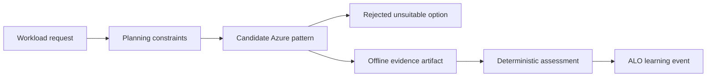

---
{
  "schema_version": 1,
  "lesson_id": "PM-01",
  "title": "Select models and Foundry services",
  "competency_ids": [
    "PM-01",
    "PM-02"
  ],
  "official_source_links": [
    "https://learn.microsoft.com/en-us/credentials/certifications/resources/study-guides/ai-103"
  ],
  "source_verified_at": "2026-07-25",
  "prerequisites": [
    "AI-103 PM domain overview",
    "Local ALO workflow",
    "Basic Azure subscription and identity vocabulary"
  ],
  "estimated_minutes": 50,
  "lab_links": [
    "scripts/labs/planned/PM-01-service-selection.py"
  ],
  "assessment_links": [
    "content/assessments/ai103/pm/PM-01.json"
  ],
  "paraphrase_statement": "This lesson is an original paraphrase based on the source registry and local curriculum map; it does not copy Microsoft prose."
}
---

# Select models and Foundry services

## Source Links

- Microsoft AI-103 study guide: https://learn.microsoft.com/en-us/credentials/certifications/resources/study-guides/ai-103

## Prerequisites and Duration

- Prerequisites: AI-103 PM domain overview, local ALO workflow, and basic Azure architecture vocabulary.
- Estimated duration: 50 minutes.

## Pre-Lesson Retrieval Questions

1. Closed book: What workload evidence would prove the planning decision is correct?
2. Closed book: Which Azure service, model, identity, or governance option is tempting but unsuitable here?
3. Closed book: What budget, quota, security, or approval failure should stop the plan before live deployment?
4. Closed book: Which event should the orchestrator record after deterministic grading?

## Substantive Explanation

Scenario focus: Choose between direct generation, retrieval grounding, agent tools, and multimodal analysis for a support assistant. This lesson specifically practices service-selection. The learner must include rejecting a general chat model when the workload requires grounded citations and tool control. The target competencies are PM-01, PM-02.

The planning task starts by translating a vague business request into a bounded Azure AI workload. A learner should not begin by naming a fashionable model or service. The first move is to identify the user goal, the data shape, the expected output, the evidence that proves correctness, and the operational constraint that could make an otherwise good design unsuitable. In AI-103 planning work, this means separating model choice from solution choice. A model can generate text, classify input, reason over a prompt, or interpret an image, but a production solution also needs identity, storage, indexing, monitoring, evaluation, budget control, and governance. The lesson therefore treats service selection as an engineering decision with evidence, not as product trivia.

Use the local-first orchestrator as the study harness. The learner answers retrieval questions before reading, studies the scenario, completes a guided exercise with hints, then attempts an independent transfer case. The assessment is deterministic. Tutor comments can coach the learner after grading, but they do not set the score, mastery, confidence, or ZPD level. This is important because planning and governance topics often invite subjective opinions. The repository avoids that ambiguity by asking for observable artifacts: a decision table, a rejected option with a clear reason, a cost or quota check, a least-privilege role boundary, a monitoring signal, or a policy gate.

The Azure side should be planned before any live resource is created. A strong answer states which Azure AI Foundry capability, Azure AI Search pattern, identity mechanism, monitoring signal, or governance feature fits the workload. It also states what can be tested offline. For example, the learner can inspect a fixture that represents search results, validate a JSON deployment plan, compare role assignments to a least-privilege checklist, or estimate token and indexing costs from a small input table. Live Azure execution comes later, guarded by explicit sandbox, budget, and teardown rules. This keeps the learning loop safe and repeatable.

The decision process should include rejection. Many wrong designs are plausible at first glance. A direct model call may be unsuitable when answers need citations from private documents. A portal-only deployment may be unsuitable when repeatability and audit trails matter. Broad user credentials may be unsuitable when a managed identity with scoped permissions can perform the same task. A larger model may be unsuitable when latency, quota, or budget constraints dominate. A tool-using agent may be unsuitable when the action is high risk and requires human approval. The learner should practice saying no with evidence because that is how planning becomes operational discipline.

The worked example should model expert reasoning. Start from the workload statement, list constraints, choose a candidate architecture, reject at least one alternative, name the evidence artifact, and define the remediation path. If the learner misses the threshold, remediation should be specific: review the decision boundary, rerun the cost check, redraw the diagram, or compare two service options again. If the learner succeeds independently, the next step should be a spaced review or a harder transfer task, not repeated hints. This keeps the learner in the zone of proximal development.

Use dual coding to connect decisions to system shape. The diagram should show the learner, planning inputs, Azure design choice, deterministic evidence, and orchestrator event. The alt text must explain the same relationship for accessibility. The reconstruction prompt should require the learner to redraw the decision flow from memory. That creates retrieval practice, not passive rereading. The diagram also prevents a common misconception: planning is not a document written after implementation; it is a set of constraints that drives implementation.

For transfer, change the surface details while preserving the planning principle. If the worked example uses an internal support assistant, the transfer case might use a compliance reviewer, a call-center summarizer, a visual inspection workflow, or an agent that can open tickets. The learner must identify what stays the same and what changes. Evidence, identity, cost, monitoring, and governance still matter, but the right service pattern may change. This contrast makes the lesson useful for the exam and for real Azure AI engineering work.

Completion is recorded as evidence. The learner should produce a short decision artifact, answer the concept checklist, and complete the assessment file linked by the lesson metadata. Passing means the deterministic rubric finds the required ideas without relying on model judgment. Anything below the configured threshold triggers remediation. The end state is not a Microsoft exam score; it is local practice evidence that updates the adaptive study system and schedules the next useful task.

A complete PM answer also states how the decision will be revisited. Model availability, quota posture, cost limits, safety settings, and identity boundaries can change as the workload matures. The learner should therefore name the signal that would force a new planning decision: a cost alert, a rate-limit breach, a failed safety evaluation, a missing citation, an unauthorized role assignment, or a monitoring trace that shows low relevance. This turns the lesson from a one-time architecture choice into an operating habit. The goal is not to memorize a static recommendation. The goal is to practice a repeatable decision loop that starts with workload evidence, rejects unsafe or unsuitable options, records deterministic proof, and schedules the next review.

## Mermaid Diagram



Alt text: A workload request is converted into constraints, compared against candidate Azure patterns, checked against at least one rejected option, validated with offline evidence, graded deterministically, and recorded as an ALO learning event.

Diagram reconstruction prompt: Redraw the planning flow from request to learning event and label where the unsuitable option is rejected.

## Concrete Azure Example

A product team asks for an Azure AI capability to support the scenario: Choose between direct generation, retrieval grounding, agent tools, and multimodal analysis for a support assistant. The learner must choose the service or governance pattern, name the evidence artifact, and document why the rejected option fails the workload constraints.

## Worked Example

1. Write the workload goal in one sentence.
2. List data, output, risk, identity, monitoring, and cost constraints.
3. Choose the smallest Azure pattern that satisfies the evidence requirement.
4. Reject one unsuitable option: rejecting a general chat model when the workload requires grounded citations and tool control.
5. Define the offline artifact that proves the decision before live Azure use.

## Guided Exercise with Fading Hints

- Hint 1, strong: Start with the user goal, evidence artifact, and hard constraint.
- Hint 2, faded: Compare the preferred Azure pattern with one rejected option.
- Hint 3, minimal: Complete the decision record and identify the orchestrator event.

## Independent Transfer Exercise

Apply the same planning rule to a different department with a stricter budget, a different identity boundary, or a higher approval requirement. Complete the decision record without hints.

## Elaboration Prompts

- Why does the selected pattern fit the workload evidence?
- How does it compare with the rejected option?
- What consequence follows if the team ignores cost, quota, security, monitoring, or governance constraints?
- Compare the offline fixture with the future live Azure deployment.

## Feynman Self-Explanation

Explain the planning decision to a new teammate without listing product names first. Start from the user goal, then explain the evidence, Azure pattern, rejected option, and safety or budget gate.

Concept checklist:

- Names the workload goal.
- Names the selected Azure pattern.
- Explains why the rejected option is unsuitable.
- Identifies deterministic evidence.
- Mentions cost, quota, security, monitoring, or governance control.

## Common Misconceptions

- Choosing the largest model before defining evidence.
- Treating a portal screenshot as repeatable deployment proof.
- Using broad credentials when scoped managed identity is sufficient.
- Counting tutor feedback as deterministic grading.

## Lab Links

- `scripts/labs/planned/PM-01-service-selection.py`

## Assessment Links

- `content/assessments/ai103/pm/PM-01.json`

## Answer Rubric Data

```json
{
  "schema_version": 1,
  "answers_are_separate_from_lesson": true,
  "retrieval_question_keys": ["rq1", "rq2", "rq3", "rq4"],
  "concept_checklist": [
    "workload goal",
    "selected Azure pattern",
    "rejected unsuitable option",
    "deterministic evidence",
    "operational control"
  ],
  "rubric_path": "content/assessments/ai103/pm/PM-01.json"
}
```
