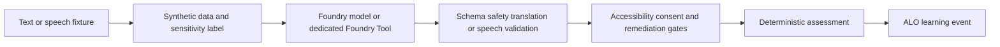

---
{
  "schema_version": 1,
  "lesson_id": "TA-02",
  "title": "Detect sentiment, safety concerns, and synthetic PII",
  "competency_ids": [
    "TA-02"
  ],
  "official_source_links": [
    "https://learn.microsoft.com/en-us/credentials/certifications/resources/study-guides/ai-103"
  ],
  "source_verified_at": "2026-07-25",
  "prerequisites": [
    "AI-103 TA domain overview",
    "Local ALO workflow",
    "Basic Azure AI Foundry language and speech vocabulary"
  ],
  "estimated_minutes": 55,
  "lab_links": [
    "scripts/labs/planned/TA-02-sentiment-safety-pii.py"
  ],
  "assessment_links": [
    "content/assessments/ai103/ta/TA-02.json"
  ],
  "paraphrase_statement": "This lesson is an original paraphrase based on the source registry and local curriculum map; it does not copy Microsoft prose."
}
---

# Detect sentiment, safety concerns, and synthetic PII

## Source Links

- Microsoft AI-103 study guide: https://learn.microsoft.com/en-us/credentials/certifications/resources/study-guides/ai-103

## Prerequisites and Duration

- Prerequisites: AI-103 TA domain overview, local ALO workflow, and basic Azure AI Foundry language and speech vocabulary.
- Estimated duration: 55 minutes.

## Pre-Lesson Retrieval Questions

1. Closed book: Should this scenario use a Foundry model, a dedicated Foundry Tool, or both?
2. Closed book: What synthetic data, PII, safety, accessibility, or consent label is required?
3. Closed book: What output contract and validation evidence prove the result is usable?
4. Closed book: Which event should the orchestrator record after deterministic grading?

## Substantive Explanation

Scenario focus: detect sentiment, tone, safety concerns, sensitive content, and synthetic PII using measurable checks. The target competencies are TA-02.

Start by classifying the text or speech task before choosing a model. Some language workloads need flexible reasoning over messy input. Others need a dedicated Foundry Tool with a stable purpose, known parameters, and predictable output. The learner should explicitly compare Foundry models versus dedicated Foundry Tools. Use a model-powered flow when the task requires broad reasoning, synthesis, or adaptation to changing instructions. Use a dedicated tool when the task is standard, constrained, and benefits from service-specific behavior, such as translation, speech transcription, text-to-speech, or structured extraction supported by a tool contract. The correct answer is not a product slogan. It is a decision based on input type, output contract, risk, latency, cost, and validation evidence.

All medical and PII examples in this lesson are synthetic. The fixture must say synthetic medical example or synthetic PII example where relevant. No real personal, clinical, or customer data belongs in lessons, tests, prompts, event logs, or screenshots. This rule is a hard boundary because language systems can make sensitive data easy to copy and hard to audit. A synthetic medical note can teach entity extraction, summarization, safety, translation, and speech handling without exposing anyone. The learner should practice identifying the data classification before running a model or tool. If the data class is unclear, the workflow should stop and request a safer fixture or approval.

The first learning step is retrieval practice. Before reading, answer from memory what the task requires: input type, data sensitivity, Azure capability, expected output shape, validation rule, accessibility need, consent requirement, and remediation path. Then compare your answer with the worked example. This prevents passive rereading and exposes weak assumptions. A fluent summary can omit a critical medication, a sentiment label can miss a safety concern, translated text can change meaning, speech recognition can fail for accents or noise, and structured JSON can be malformed. The deterministic assessment grades visible evidence, not model confidence language.

For this scenario, the rejected option is load-bearing: Reject using real personal, clinical, or customer data in fixtures because the lesson requires synthetic PII examples only. Rejection proves judgment. If the workflow needs JSON, a paragraph summary is insufficient. If the example contains real names, phone numbers, clinical notes, or customer identifiers, the fixture is invalid. If speech is captured without consent, the design is incomplete. If translation changes domain meaning, remediation needs human review or a constrained terminology list. If audio reasoning is low confidence, an agent should not take side effects. These are concrete engineering controls, not general caution.

The Azure architecture should be safe to practice offline. Use fixtures for text input, synthetic PII markers, translation pairs, speech transcripts, audio metadata, safety labels, and expected JSON outputs. A live Azure call can be added later only after sandbox configuration, budget limits, consent rules, and teardown instructions exist. This preserves the local-first ALO design. The app records the lesson result, assessment score, remediation state, and review schedule in repository state; it does not need a cloud dependency to prove that the learner understands the decision boundary.

Accessibility and consent are required for speech lessons. Speech-to-text should produce captions or transcripts that can be reviewed. Text-to-speech should consider voice disclosure, user preference, and alternatives for users who cannot or do not want audio. Audio reasoning should record consent status and confidence. Translation involving speech should include accessibility captions and a way for a user to confirm meaning. These controls belong in the lesson even when the example is synthetic because the learner is practicing production habits.

Use dual coding to make the workflow visible. The diagram shows input text or speech moving through sensitivity classification, Azure model or tool selection, validation, accessibility and consent gates, deterministic assessment, and an ALO event. The alt text explains the diagram in prose. The reconstruction prompt asks the learner to redraw the flow from memory. If the learner cannot place PII screening, consent, schema validation, or translation review, remediation should target that missing primitive.

The ZPD scaffold uses strong, faded, and independent support. With strong support, complete a partially filled language workflow card: task, synthetic fixture label, Foundry model or dedicated tool, output schema, validation, accessibility or consent gate, and remediation. With faded support, compare two options and reject the weaker one. Independently, transfer the same rule to a new scenario. If mastery is below threshold, remediate the missing concept: run retrieval questions, compare model versus tool, label synthetic PII, rewrite the JSON schema, or explain consent in plain language. If mastery is above threshold, schedule spaced review with a different modality.

Interleaving is deliberate. Entities and summaries connect to structured output. Sentiment connects to safety and sensitive content. Translation connects to speech, accessibility, and domain review. Domain extraction connects to medical examples and schema validation. Speech connects to agent modalities and audio reasoning. The learner should not memorize isolated terms. They should practice choosing the correct capability when text, speech, safety, and structured output compete.

A complete answer ends with operational evidence. Record that examples are synthetic, identify whether the selected Azure path is a Foundry model or dedicated Foundry Tool, include validation output, label PII handling, include consent and accessibility for speech, and name remediation when the output is unsafe, malformed, or low confidence. Tutor feedback may explain the mistake, but deterministic rubrics update mastery. That keeps the local-first Adaptive Learning Orchestrator intact while expanding it toward a full AI-103 study system.

## Mermaid Diagram



Alt text: A synthetic text or speech fixture flows through sensitivity labeling, model or Foundry Tool selection, validation, accessibility and consent gates, deterministic assessment, and an ALO learning event.

Diagram reconstruction prompt: Redraw the text or speech workflow and label synthetic data, model-versus-tool choice, validation, accessibility, consent, and remediation.

## Concrete Azure Example

A synthetic customer-support transcript includes a fake name, fake phone number, and fake account phrase for PII detection practice; the fixture is labeled synthetic and contains no real customer data. The learner must document that examples are synthetic, choose between Foundry models and dedicated Foundry Tools, and record validation before live Azure use.

## Worked Example

1. State the language or speech user goal and expected output.
2. Label the fixture as synthetic medical example, synthetic PII example, synthetic speech fixture, or another synthetic safe class.
3. Choose a Foundry model, a dedicated Foundry Tool, or both, and explain why.
4. Reject one unsuitable option: Reject using real personal, clinical, or customer data in fixtures because the lesson requires synthetic PII examples only.
5. Define the validation, accessibility, consent, or remediation evidence.

## Guided Exercise with Fading Hints

- Hint 1, strong: Start with task, synthetic label, model-versus-tool choice, output schema, validation, accessibility, consent, and remediation.
- Hint 2, faded: Compare the preferred workflow with the rejected shortcut.
- Hint 3, minimal: Complete the evidence record and identify the orchestrator event.

## Independent Transfer Exercise

Apply the same rule to a different synthetic department scenario with stricter PII, domain vocabulary, translation, or speech-accessibility needs. Complete the workflow record without hints.

## Elaboration Prompts

- Why does this workflow fit the text or speech user goal?
- How does it compare with the rejected option?
- What breaks if synthetic PII labeling, accessibility, consent, schema validation, or domain review is ignored?
- Compare using a Foundry model with using a dedicated Foundry Tool.

## Feynman Self-Explanation

Explain this workflow to a new teammate without product slogans. Start from the user goal, then explain synthetic data handling, model-versus-tool choice, validation, accessibility or consent, and remediation.

Concept checklist:

- Names the text or speech user goal.
- Labels examples as synthetic.
- Chooses Foundry model versus dedicated Foundry Tool.
- Includes validation, safety, accessibility, or consent.
- Explains the rejected option and remediation.

## Common Misconceptions

- Using real personal, clinical, or customer data in a lesson fixture.
- Treating a fluent summary or translation as verified without validation.
- Choosing a general model when a dedicated Foundry Tool has the better output contract.
- Skipping accessibility and consent in speech workflows.
- Treating tutor feedback as deterministic grading.
- Keyword focus for review: sentiment, tone, safety, sensitive content, synthetic PII.

## Lab Links

- `scripts/labs/planned/TA-02-sentiment-safety-pii.py`

## Assessment Links

- `content/assessments/ai103/ta/TA-02.json`

## Answer Rubric Data

```json
{
  "schema_version": 1,
  "answers_are_separate_from_lesson": true,
  "retrieval_question_keys": ["rq1", "rq2", "rq3", "rq4"],
  "concept_checklist": [
    "text or speech user goal",
    "synthetic data label",
    "Foundry model versus dedicated Foundry Tool",
    "validation safety accessibility consent",
    "remediation"
  ],
  "rubric_path": "content/assessments/ai103/ta/TA-02.json"
}
```
